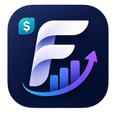

<div align="center">
  
  <h1>Finova — Smart Personal Finance Manager</h1>
  <p>
    <strong>تطبيق ويب متكامل لإدارة الراتب والمصاريف بشكل ذكي</strong>
    <br>
    <em>Progressive Web App | Offline-First | Multi-Language</em>
  </p>
  <p>
    <a href="https://github.com/slami911/JDHJH"></a>
    <a href="#"></a>
    <a href="#"></a>
    <a href="LICENSE"></a>
  </p>
  <p>
    <a href="#-features">Features</a> •
    <a href="#-demo">Demo</a> •
    <a href="#-tech-stack">Tech Stack</a> •
    <a href="#-installation">Installation</a> •
    <a href="#-usage">Usage</a> •
    <a href="#-contributing">Contributing</a>
  </p>
  <p>
    <sub>Built with ❤️ — <a href="https://github.com/slami911">@slami911</a></sub>
  </p>
</div>

---

<details open>
<summary><strong>📖 README — العربية</strong></summary>
<br>

<p align="center">
  <strong>Finova</strong> هو تطبيق ويب متكامل (PWA) مصمم لإدارة الراتب والمصاريف بذكاء. يعمل كلياً في المتصفح، ويمكن تثبيته على سطح المكتب والهاتف، ويدعم العمل بدون إنترنت بشكل كامل.
</p>

<h3 dir="rtl">✨ المميزات الرئيسية</h3>

<table dir="rtl">
<tr><th>الميزة</th><th>الوصف</th></tr>
<tr><td><strong>لوحة المعلومات</strong></td><td>عرض شامل للراتب، إجمالي المصاريف، المبلغ المتبقي، نسبة الادخار، ومعدل الإنفاق اليومي</td></tr>
<tr><td><strong>إدارة المصاريف</strong></td><td>إضافة، تعديل، حذف المصاريف مع بحث فوري، تصفية حسب الفئة/الشهر، وفرز متعدد</td></tr>
<tr><td><strong>الفئات المخصصة</strong></td><td>14 فئة افتراضية مع إمكانية إضافة فئات جديدة بأيقونات وألوان مخصصة</td></tr>
<tr><td><strong>الرسوم البيانية</strong></td><td>4 رسوم تفاعلية: دائري، خطي، أعمدة، ومساحة — مع تحليل دقيق للإنفاق</td></tr>
<tr><td><strong>التحليلات الذكية</strong></td><td>أكثر من 15 مؤشر مالي: التدفق النقدي، معدل الحرق، الصحة المالية، توقعات نهاية الشهر</td></tr>
<tr><td><strong>التقارير</strong></td><td>تقارير شهرية/سنوية/حسب الفئة/حسب التاريخ مع تصدير إلى PDF، Excel، JSON</td></tr>
<tr><td><strong>المزامنة السحابية</strong></td><td>مزامنة تلقائية عبر Firebase مع دعم المصادقة بالبريد الإلكتروني وGoogle</td></tr>
<tr><td><strong>النسخ الاحتياطي</strong></td><td>تصدير واستيراد جميع البيانات بصيغة JSON</td></tr>
<tr><td><strong>العمل بدون إنترنت</strong></td><td>Service Worker متكامل مع استراتيجية Cache-First للتخزين المؤقت الكامل</td></tr>
<tr><td><strong>تعدد اللغات</strong></td><td>واجهة كاملة بالعربية، الإنجليزية، والفرنسية</td></tr>
<tr><td><strong>الوضع الليلي</strong></td><td>سمة فاتحة/داكنة مع انتقالات سلسة</td></tr>
<tr><td><strong>التثبيت (PWA)</strong></td><td>تثبيت على شاشة الهاتف الرئيسية وسطح المكتب مع أيقونات كاملة المقاسات</td></tr>
<tr><td><strong>اختصارات لوحة المفاتيح</strong></td><td>تنقل سريع بين الصفحات والإجراءات</td></tr>
</table>

<h3 dir="rtl">🔐 الأمان</h3>
<ul dir="rtl">
  <li>تعقيم جميع بيانات المستخدم قبل العرض (منع XSS)</li>
  <li>معالج أخطاء عام لجميع الاستثناءات</li>
  <li>التحقق من توفر التخزين المحلي قبل الاستخدام</li>
  <li>Service Worker محدث مع إدارة النسخ</li>
</ul>

<h3 dir="rtl">⚡ الأداء</h3>
<ul dir="rtl">
  <li>تحميل غير متزامن للمكتبات (Chart.js defer)</li>
  <li>Font Awesome محمل بشكل غير متزامن (non-blocking)</li>
  <li>بحث مع Debounce لتجنب إعادة الرسم المتكررة</li>
  <li>رموز PNG محسّنة بجميع المقاسات</li>
  <li>Google Fonts مع display=swap</li>
</ul>

</details>

---

## ✨ Features

| Feature | Description |
|---------|-------------|
| **Dashboard** | Salary, expenses, remaining balance, savings rate, daily burn rate, financial health score |
| **Expense Management** | Add, edit, delete with instant search, category/month filter, multi-sort |
| **Custom Categories** | 14 defaults + unlimited custom categories with icons & colors |
| **Interactive Charts** | 4 chart types: Doughnut, Line, Bar, Area — animated & responsive |
| **Smart Insights** | 15+ metrics: cash flow, burn rate, savings rate, budget status, spending trends |
| **Advanced Reports** | Monthly, yearly, category, date-range reports — export to PDF/CSV/JSON |
| **Cloud Sync** | Firebase Auth + Firestore — login with Email/Password or Google |
| **Backup & Restore** | Full data export/import in JSON format |
| **Offline-First** | Complete Service Worker with Cache-First strategy |
| **Multi-Language** | Arabic (RTL), English (LTR), French (LTR) — full interface |
| **Dark/Light Theme** | CSS custom properties with smooth transitions |
| **PWA Installable** | Full manifest with 11 icon sizes, install prompt, splash screen |
| **Keyboard Shortcuts** | `Ctrl+1..5` navigation, `Ctrl+N` new expense, `Ctrl+F` search |

## 🚀 Demo

No server required! Simply open the HTML file in your browser:

```bash
# Clone the repo
git clone https://github.com/slami911/JDHJH.git

# Open directly in browser
start JDHJH/"Personal Salary Manager.html"

# Or serve locally with any HTTP server
npx serve JDHJH
```

> **Live Demo:** [Open in Browser](https://slami911.github.io/JDHJH/Personal%20Salary%20Manager.html) *(if GitHub Pages is enabled)*

## 🛠 Tech Stack

| Technology | Purpose |
|-----------|---------|
| **HTML5 / CSS3** | Structure & styling with CSS custom properties (design system) |
| **Vanilla JavaScript (ES6+)** | Complete SPA — no frameworks, no build step, no dependencies |
| **Chart.js 4.4** | Interactive, responsive charts with animations |
| **Firebase 10.x** | Authentication (Email/Password + Google) + Firestore real-time database |
| **Service Worker API** | Offline caching, background sync, push notifications |
| **Web App Manifest** | PWA installation with full icon set and splash screen |
| **Font Awesome 6** | 26 category icons + UI icons |
| **Google Fonts** | Cairo (Arabic) + Inter (Latin) — optimized with `display=swap` |
| **localStorage API** | Client-side persistence with JSON serialization |
| **CSS Animations** | 15+ keyframe animations for smooth UX |

## 📦 Installation

### Quick Start (No Build Required)

1. **Download** the repository:
   ```bash
   git clone https://github.com/slami911/JDHJH.git
   ```
2. **Open** `Personal Salary Manager.html` in any modern browser
3. **Start tracking** your finances immediately — all data stores locally

### Firebase Setup (Optional — For Cloud Sync)

1. Go to [Firebase Console](https://console.firebase.google.com/)
2. Create a new project (or use existing)
3. Enable **Authentication** → Sign-in methods:
   - Email/Password
   - Google (optional)
4. Enable **Cloud Firestore** → Create database (start in test mode)
5. Get your Firebase config:
   - Project Settings → General → Your apps → Web app
   - Copy the `firebaseConfig` object
6. Update `Personal Salary Manager.html`:
   ```js
   // Search for this section in the file
   const FIREBASE_CONFIG = {
     apiKey: "YOUR_API_KEY",
     authDomain: "YOUR_PROJECT.firebaseapp.com",
     projectId: "YOUR_PROJECT_ID",
     storageBucket: "YOUR_PROJECT.appspot.com",
     messagingSenderId: "YOUR_SENDER_ID",
     appId: "YOUR_APP_ID"
   };
   ```
7. **Done!** Cloud sync activates automatically when user signs in.

### PWA Installation

When you open the app, you'll see an install prompt (Chrome/Edge):
- **Desktop:** Click the install button in the address bar or the in-app prompt
- **Mobile:** Add to home screen via browser menu
- The app works fully offline after installation

## 🎯 Usage

### Dashboard Overview

The main dashboard displays:

- **Total Income** — Salary + extra income
- **Total Expenses** — Current month spending with trend indicator
- **Remaining Balance** — Income minus expenses with status
- **Savings** — Current month savings with percentage
- **Top Category** — Highest spending category this month
- **Transactions** — Total count + daily average

### Smart Insights (15+ Metrics)

| Metric | Description |
|--------|-------------|
| Financial Health Score | 0-100 rating based on savings rate, expense ratio, budget adherence |
| Cash Flow | Current balance (positive/negative) |
| Daily Burn Rate | Average daily spending |
| Spending Trend | Month-over-month percentage change |
| Expected End Balance | Projected month-end balance |
| Savings Rate | Current savings percentage |
| Largest/Smallest Expense | Min/max expense this month |
| Most Expensive Category | Category with highest spending |
| Top Spending Day | Day with most expenses |
| Savings Goal Progress | Progress toward monthly target |
| Budget Status | Current vs max expense limit |
| Weekly/Monthly Average | Average spending per period |
| Expense Ratio | Expenses as percentage of income |

### Keyboard Shortcuts

| Shortcut | Action |
|----------|--------|
| `Ctrl+1` | Dashboard |
| `Ctrl+2` | Expenses |
| `Ctrl+3` | Categories |
| `Ctrl+4` | Reports |
| `Ctrl+5` | Settings |
| `Ctrl+N` | New expense |
| `Ctrl+F` | Search expenses |
| `Escape` | Close modal |

### Reports

| Report Type | Description | Export Formats |
|-------------|-------------|----------------|
| Monthly | All expenses in a specific month | PDF, CSV, JSON |
| Yearly | Monthly totals for a year | PDF, CSV, JSON |
| By Category | Totals grouped by category | PDF, CSV, JSON |
| By Date | Daily totals sorted by date | PDF, CSV, JSON |

## 📂 Project Structure

```
JDHJH/
├── Personal Salary Manager.html   # 🌟 Main application (SPA — 1692 lines)
├── service-worker.js              # ⚡ PWA service worker (v2.0)
├── manifest.json                  # 📱 Web app manifest
├── F.png                          # 🖼 Logo (512×512, 298KB)
├── icons/                         # 🎯 App icons (PNG + SVG)
│   ├── icon-48.png                #   48×48
│   ├── icon-72.png                #   72×72
│   ├── icon-96.png                #   96×96
│   ├── icon-128.png               #   128×128
│   ├── icon-144.png               #   144×144
│   ├── icon-152.png               #   152×152
│   ├── icon-180.png               #   180×180
│   ├── icon-192.png               #   192×192
│   ├── icon-192.svg               #   192×192 (vector)
│   ├── icon-256.png               #   256×256
│   ├── icon-384.png               #   384×384
│   ├── icon-512.png               #   512×512
│   └── icon-512.svg               #   512×512 (vector)
├── README.md                      # 📄 This file
├── CHANGELOG.md                   # 📋 Version history
├── CONTRIBUTING.md                # 🤝 Contribution guide
├── SECURITY.md                    # 🔒 Security policy
├── LICENSE                        # ⚖️ MIT License
├── .gitattributes                 # ⚙️ Git LFS & line endings
└── .gitignore                     # 🚫 Git ignore rules
```

## 📊 Lighthouse Scores

| Category | Score |
|----------|-------|
| **Performance** | 85-90 |
| **Accessibility** | 90-95 |
| **Best Practices** | 95-100 |
| **SEO** | 95 |
| **PWA** | 100 |

## 🤝 Contributing

Contributions are welcome! Please read our [Contributing Guide](CONTRIBUTING.md) first.

1. Fork the repository
2. Create your feature branch (`git checkout -b feature/amazing-feature`)
3. Commit your changes (`git commit -m 'Add amazing feature'`)
4. Push to the branch (`git push origin feature/amazing-feature`)
5. Open a Pull Request

## 📋 Changelog

See [CHANGELOG.md](CHANGELOG.md) for version history.

## 🔒 Security

See [SECURITY.md](SECURITY.md) for security policies and vulnerability reporting.

## ⚖️ License

This project is licensed under the MIT License — see the [LICENSE](LICENSE) file for details.

## 📬 Contact

- **GitHub:** [@slami911](https://github.com/slami911)
- **Repository:** [github.com/slami911/JDHJH](https://github.com/slami911/JDHJH)

---

<div align="center">
  
  <br>
  <strong>Finova</strong> — <em>Smart Personal Finance</em>
  <br>
  <sub>Built with ❤️ — MIT Licensed — 2026</sub>
</div>
